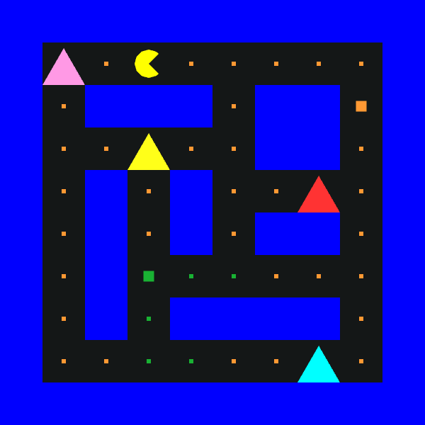
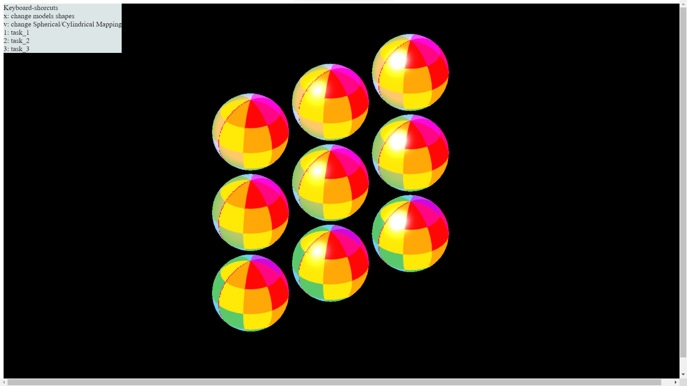
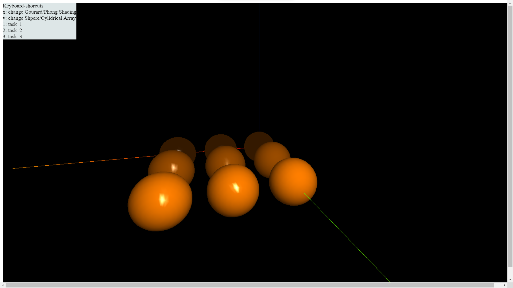

# Computer Graphics Assignments
Collection of all assignments from the Computer Graphics course.
Teammates: Divyam [@cdivyam](https://github.com/cdivyam) and Aniruddh [@aniruddhkb](https://github.com/aniruddhkb)

  
  
  
  
  
  

## Assignment 1:
The goal of this assignment was to develop a WebGL program that will allow the user to pick a Pac-Man maze configuration.

### Learning objectives:
- WebGL programming 
- Creation and rendering of simple 2D geometric shapes as primitives
- Transformation of 2D objects and scene -- instance-wise implementation
- Key(board) events for changing control modes, and transformation implementation 
- Mouse events for picking objects

## Assignment 2:
This assignment simulates a simple game on a playground shaped like a regular n-sided polygon. There are m players (with m < n) positioned at different corners. One player, chosen by the user as the "catcher," moves to any other corner in a straight line. Each corner can only hold one player at a time. If the catcher moves to an occupied corner, the player already there must move to another unoccupied corner.

### Learning objectives:
- Creating 3D models (using a modeling tool)
- Importing 3D mesh models
- View transformations
- Manipulating 3D objects using transformations
- Computing animation paths and transforms
- Using the mouse to manipulate the scene

## Assignment 3:
The objective of this assignment is to set up lighting, implement local illumination shading models, and texture mapping using a checkerboard pattern. The implementation of A3 is to be considered as a sandbox/experimental testbed for that for A4. There are 3 tasks in this assignment: implementing Gourad and Phong shading, implementing Blinn-Phong illumination model and texture mapping using both spherical and cylindrical maps.

### Learning objectives:
- Implementing Gouraud and Phong shading models, and toggle between them
- Setting up local illumination with multiple light sources using Blinn-Phong illumination models
- Texture mapping experiments with checkerboard

## Assignment 4:
The objective of this assignment is to simulate a “chain reaction” machine or activity, where a simple movement of one object in the scene sets off a chain reaction that generates a sequence of movements of other objects to achieve a desired goal or effect.

### Learning objectives:
- Modeling a dynamic scene with a Scene Graph and relative transforms
- Procedural animation of a scene including collision detection
- Dynamic lights and camera
